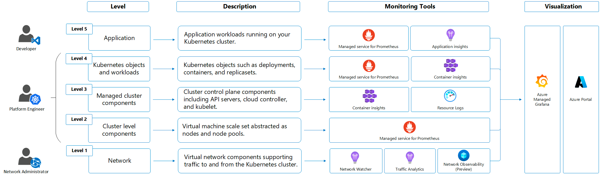
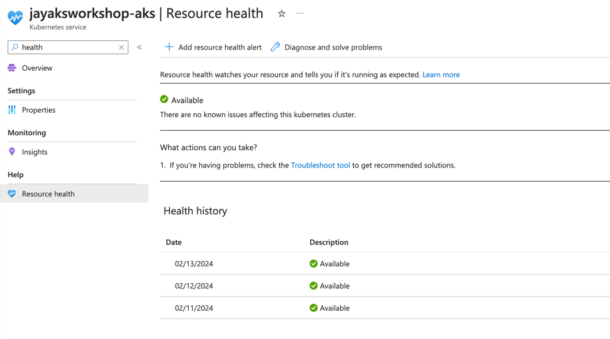
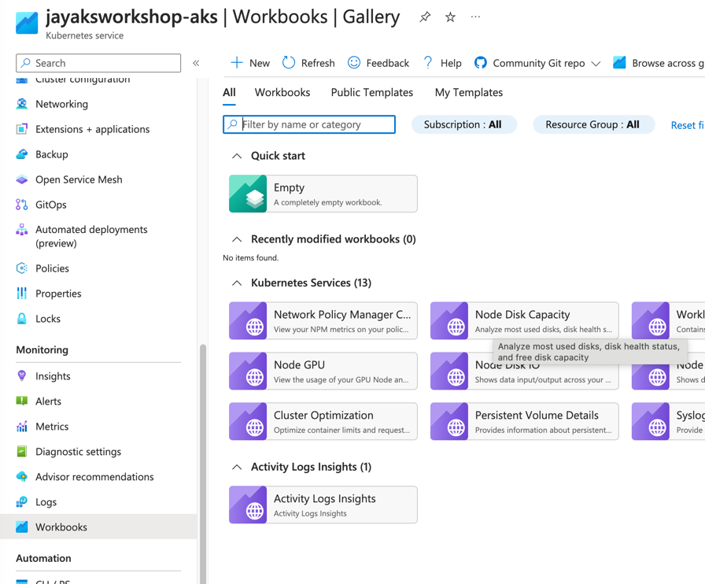
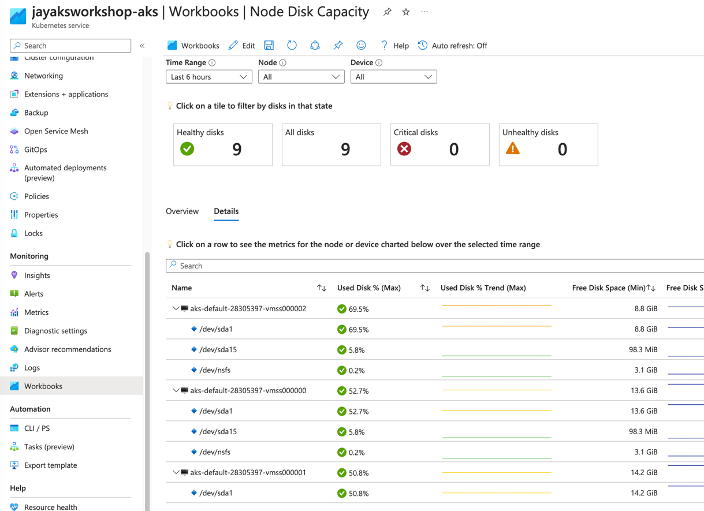
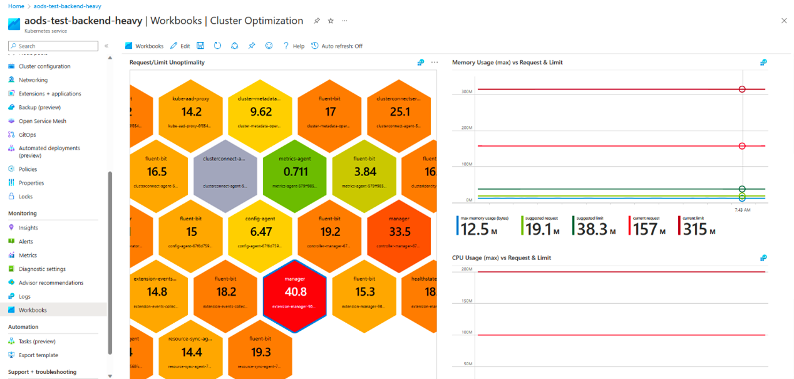

# Cluster Monitoring

This section will cover the monitoring and logging of an AKS cluster. Just like any other Azure services, AKS generates the same kinds of monitoring data as shown below. 



Basic Azure resources monitoring data includes:

- Platform metrics : Automatically collected for AKS clusters at no cost. Ex. https://learn.microsoft.com/en-us/azure/azure-monitor/reference/supported-metrics/microsoft-containerservice-managedclusters-metrics
- Activity logs : Automatically collected for AKS clusters at no cost. Track the activity of create/update/delete operations on the AKS cluster.
- Resource logs : Control plane logs for AKS are implemented as resource logs. Cost associated with storage of these logs in Log Analytics.

AKS specific monitoring data includes:

- Prometheus metrics: When you enable metric scraping for your cluster, Prometheus metrics are collected by Azure Monitor managed service for Prometheus and stored in an Azure Monitor workspace. Cost associated with storage of these logs in Azure Monitor workspace and managed Prometheus service.
- Container insights: Container insights collects various logs and performance data from a cluster including stdout/stderr streams and stores them in a Log Analytics workspace and Azure Monitor Metrics.

## Logging And Alerts

__Azure Monitor Container insights__ allows you to collect metrics, live logs, and logs for investigative purposes. Monitoring and logging the health and performance of your Azure Kubernetes Service (AKS) cluster is important to ensure that your applications are up and running as expected. It's first important to understand the difference between __Logs__ and __Metrics__. Both serve different purposes and are components of observability.

- Metrics - Typically a time series of numbers over a specific amount time
- Logs - Used for exploratory analysis of a system or application

The following screenshot describes how monitoring can be done.


Cluster Health is being tracked and can be viewed in the Cluster Health section of the AKS Cluster.



By clicking the Nodes tab in under Insights it also gives you the possibility to drill down the tree and expand nodes that where you might have a pod running high on CPU. In this case, I 'forgot' to add limits in my manifest file during the busybox pod creation and is now using all the CPU it is asking for.


## Azure Monitor Workbooks

Azure Monitor Workbooks is a feature in Azure Monitor that provides a flexible canvas for data analysis and the creation of rich visual reports. Workbooks help you to create visual reports that help in data analysis. We will check a few workbooks that are the most useful for monitoring AKS clusters.

### Node Disk Capacity and IOPS

Monitoring disk space a critical part of keeping any Kubernetes cluster alive. Enabling and selecting workbooks you get a out of box dashboard that can help you.



Here is an example of disk capacity



Here is an example of bytes being written per sec.


### Cluster Optimization

The Cluster Optimization Workbook provides multiple analyzers that give you a quick view of the health and performance of your Kubernetes cluster. It has multiple analyzers that each provide different information related to your cluster. The workbook requires no configuration once Container insights has been enabled on the cluster.

- Detection of recent liveness probe failures and their frequency.
- Identification of event anomalies that indicate recent increases in event volume and grouping similar events for streamlined analysis.
- Identification of containers with high or low CPU and memory limits and requests, along with suggested limit and request values for container optimization.



In the next section, we'll dive into how to view live logs, create log query, and how to create an alert from the query.

## Live Logs

Live logs are a nice way to see logs being emitted from STDOUT/STDERR of a container. You can give developers access to the live logging, so they can live debug issues happening with their application. This allows you to limit their exposure to using __kubectl__ for application issues.

To access the live logs you will need to navigate to the Insights section of the AKS Cluster

Portal->Azure Kubernetes Service->Cluster->Insights


This is a great way of identifying error messages.


### Creating Alerts Based on Log Query

Microsoft uses a query language called Kusto, which can be used to create dashboards based on a query. The following screenshot describes these functions and how to use them:


Now if we want to create a custom Kusto query we can do the following search, but remember to change the cluster name:

```bash
// **************************
// CPU consumption
// **************************
KubePodInventory
| where ClusterName == '**change-me-to-my-clustername**'
| where isnotempty(Computer) // eliminate unscheduled pods
| where PodStatus in ('Running','Unknown')
| summarize by bin(TimeGenerated, 1m), Computer, ClusterId, ContainerName, Namespace
| project TimeGenerated, InstanceName = strcat(ClusterId, '/', ContainerName), Namespace
| join (
Perf
| where ObjectName == 'K8SContainer'
| where CounterName == 'cpuUsageNanoCores'
| summarize UsageValue = max(CounterValue) by bin(TimeGenerated, 1m), Computer, InstanceName, CounterName
| project-away CounterName
| join kind = fullouter
(Perf
| where ObjectName == 'K8SContainer'
| where CounterName == 'cpuRequestNanoCores'
| summarize RequestValue = max(CounterValue) by bin(TimeGenerated, 1m), Computer, InstanceName, CounterName
| project-away CounterName
) on Computer, InstanceName, TimeGenerated
| project TimeGenerated = iif(isnotempty(TimeGenerated), TimeGenerated, TimeGenerated1),
          Computer = iif(isnotempty(Computer), Computer, Computer1),
          InstanceName = iif(isnotempty(InstanceName), InstanceName, InstanceName1),
          UsageValue = iif(isnotempty(UsageValue), UsageValue, 0.0),
          RequestValue = iif(isnotempty(RequestValue), RequestValue, 0.0)
| extend ConsumedValue = iif(UsageValue > RequestValue, UsageValue, RequestValue)
) on InstanceName, TimeGenerated
| summarize TotalCpuConsumedCores = sum(ConsumedValue) / 60 / 1000000 by bin(TimeGenerated, 1h), Namespace
```

If we run that query with the changed cluster name you should see something a la the following. In case you have multi namespaces it will also be shown.


Here is another example where we do it based on Memory per namespace


Often we also want to create an easy way to see the state of running pods; for example, if they are running or failed.

The following Kusto query gives you the following:

```bash
ContainerInventory
| where TimeGenerated >= ago(30m)
| summarize AggregatedValue = dcount(ContainerID) by ContainerState, Image
| render columnchart
```


## Next Steps

[Validate Scenarios](validate-scenarios/README.md)

## Key Links

- [Create log alerts from Container insights](https://docs.microsoft.com/en-us/azure/azure-monitor/insights/container-insights-alerts)
