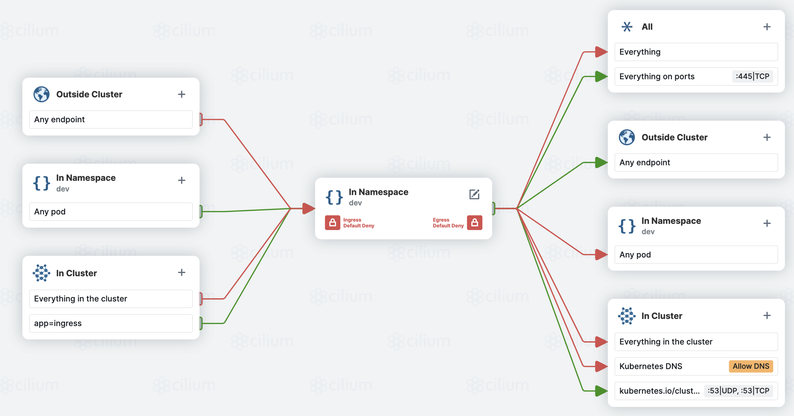

# Kubernetes Cluster Security

Kubernetes community put together the very nice guide around the security of Kubernetes platform -  [Overview of Cloud Native Security](https://kubernetes.io/docs/concepts/security/overview/) that defines the seam between different layer of Kubernetes and recommend the best practices for various aspects.

In this lab, we will cover three areas as below. These are from Cloud Native Security model. 

1. Ensuring that pods meet defined Pod Security Standards
2. Network Policies
3. Container Vulnerability Scanning


## Pod Security Policy and Pod Security Admission

In early days, security policy enforcement was handled by something called "PSP" or PodSecurityPolicy. PSP was a cluster-level resource that controlled security sensitive aspects of the pod specification. The PodSecurityPolicy objects define a set of conditions that a pod must run with in order to be accepted into the system, as well as defaults for the related fields. The PSP objects are namespaced, and they are used to control the security context that a pod runs with. 

PSP was deprecated in Kubernetes v1.21 and removed in v1.25. The replacement for PSP is Pod Security Admission or Open Policy Agent. OPA is a general-purpose policy engine that solves a number of policy-related use cases. OPA provides a high-level declarative language that lets you specify policy as code and simple APIs to offload policy decision-making from your software. OPA can be used to enforce policies in microservices, Kubernetes, CI/CD pipelines, API gateways, and more.

We will try both OPA and Pod Security Admission. 

### Azure Policy and OPA

Azure Policy is built based on OPA, and it provides a way to create, assign, and manage policies on AKS. These policies enforce different rules and effects over your resources, so those resources stay compliant with your corporate standards and service level agreements. policies in AKS.

In this section we will set up the AKS specific policies we want to enforce. 

- Registry Whitelisting

 We will use "Ensure only allowed container images in Kubernetes Cluster" to whitelist the registry that contains "kevingbb"


```bash
# Look at Created Resources
# Check Resources
kubectl get crd | grep gatekeeper
kubectl get constrainttemplate,config -n gatekeeper-system

# Test out Allowed Registry Policy Against production Namespace
kubectl run centosprod --image=centos -it --rm -n production

# Try again with Image from kevingbb
kubectl run bobblehead --image=kevingbb/khbobble -n production

# What did you notice with the last command? The main image got pulled, but the sidecar images did not :).

# Try again in default Namespace
kubectl run centosdefault --image=centos -it --rm -n default

# Test out Connectivity
curl 100.64.2.4
# Exit out of Pod
exit
```

### Pod Security Admission

Pod Security Admission (PSA) uses labels to enforce Pod Security Standards policies on pods running in a namespace. AKS enables Pod Security Admission is enabled by default. 

Let's try the Pod Security Admission. Steps are from AKS official documentation - Enforce a Pod Security Admission policy with a deployment

1. Create two namespaces using the kubectl create namespace command.

```bash
kubectl create namespace test-restricted
kubectl create namespace test-privileged
```

2. Enable a PSA policy for each namespace, one with the restricted policy and one with the baseline policy, using the kubectl label command.
```bash
kubectl label --overwrite ns test-restricted pod-security.kubernetes.io/enforce=restricted pod-security.kubernetes.io/warn=restricted
kubectl label --overwrite ns test-privileged pod-security.kubernetes.io/enforce=privileged pod-security.kubernetes.io/warn=privileged
```

This configures the test-restricted and test-privileged namespaces to block running pods and generate a user-facing warning if any pods that don't meet the configured policy attempt to run.

3. Attempt to deploy pods to the test-restricted namespace using the kubectl apply command. This command results in an error because the test-restricted namespace is configured to block pods that don't meet the restricted policy.

```bash
kubectl apply --namespace test-restricted -f https://raw.githubusercontent.com/Azure-Samples/azure-voting-app-redis/master/azure-vote-all-in-one-redis.yaml
```

The following example output shows a warning stating the pods violate the configured policy:

```bash
...
Warning: would violate PodSecurity "restricted:latest": allowPrivilegeEscalation != false (container "azure-vote-back" must set securityContext.allowPrivilegeEscalation=false), unrestricted capabilities (container "azure-vote-back" must set securityContext.capabilities.drop=["ALL"]), runAsNonRoot != true (pod or container "azure-vote-back" must set securityContext.runAsNonRoot=true), seccompProfile (pod or container "azure-vote-back" must set securityContext.seccompProfile.type to "RuntimeDefault" or "Localhost")
deployment.apps/azure-vote-back created
service/azure-vote-back created
Warning: would violate PodSecurity "restricted:latest": allowPrivilegeEscalation != false (container "azure-vote-front" must set securityContext.allowPrivilegeEscalation=false), unrestricted capabilities (container "azure-vote-front" must set securityContext.capabilities.drop=["ALL"]), runAsNonRoot != true (pod or container "azure-vote-front" must set securityContext.runAsNonRoot=true), seccompProfile (pod or container "azure-vote-front" must set securityContext.seccompProfile.type to "RuntimeDefault" or "Localhost")
deployment.apps/azure-vote-front created
service/azure-vote-front created
```

4. Confirm there are no pods running in the test-restricted namespace using the kubectl get pods command.
```bash
kubectl get pods --namespace test-restricted 
```

The following example output shows no pods running in the test-restricted namespace:

```bash
No resources found in test-restricted namespace.
```

5. Attempt to deploy pods to the test-privileged namespace using the kubectl apply command. This time, the pods should deploy successfully because the test-privileged namespace is configured to allow pods that violate the privileged policy.
```bash
kubectl apply --namespace test-privileged -f https://raw.githubusercontent.com/Azure-Samples/azure-voting-app-redis/master/azure-vote-all-in-one-redis.yaml 
```

The following example output shows the pods deployed successfully:
```bash
deployment.apps/azure-vote-back created
service/azure-vote-back created
deployment.apps/azure-vote-front created
service/azure-vote-front created
```

6. Confirm you have pods running in the test-privileged namespace using the kubectl get pods command.

```bash
kubectl get pods --namespace test-privileged
```
The following example output shows two pods running in the test-privileged namespace:
```bash
NAME                               READY   STATUS    RESTARTS   AGE
azure-vote-back-6fcdc5cbd5-svbdf   1/1     Running   0          2m29s
azure-vote-front-5f4b8d498-tqzwv   1/1     Running   0          2m28s
```

## Network Policies

Kubernetes Network Policies are a native Kubernetes resource that controls the traffic between pods. On AKS, there are two network policy options: Azure Network Policy and Calico Network Policy. In the cluster-provisioning lab, we chose to use Calico Network Policy which you can see from acraks.tf file. 

We also created a few network policies in the cluster-provisioning lab with GitOps configuration which you can see from the cluster-config folder. np-deny-all.yaml is a network policy that denies all traffic from/to the dev namespace. Then np-allow-consolidation.yaml only allows certain traffic like egress to system pods+Core DNS and ingress from ingress controller namespace app-routing-system. 



We will test the network policy by creating a few pods in the dev and production namespaces and see if they can communicate with each other. 

Create a server pod in the dev namespace  which listens on port 80 and a client pod in the production namespace which tries to connect to the server pod. 

```bash
kubectl run server -n dev --image=k8s.gcr.io/e2e-test-images/agnhost:2.33 --labels="app=server" --port=80 --command -- /agnhost serve-hostname --tcp --http=false --port "80"


kubectl run -it client -n production --image=k8s.gcr.io/e2e-test-images/agnhost:2.33 --command -- bash
bash-5.0# /agnhost connect 100.64.1.31:80  --timeout=3s --protocol=tcp
TIMEOUT
```

100.64.1.31 is the ip address of the server pod. The client pod is not able to connect to the server pod as it times out. We will create a new network policy to allow traffic from the production namespace to the dev namespace. 

```yaml
apiVersion: networking.k8s.io/v1
kind: NetworkPolicy
metadata:
  name: demo-policy
  namespace: dev
spec:
  podSelector:
    matchLabels:
      app: server
  ingress:
  - from:
    - namespaceSelector:
        matchLabels:
          app: production
    - podSelector:
        matchLabels:
          run: client
    ports:
    - port: 80
      protocol: TCP
```

After applying the network policy, the client pod is able to connect to the server pod as it does not time out. 

```bash
bash-5.0# /agnhost connect 100.64.1.31:80  --timeout=3s --protocol=tcp
bash-5.0#
```

## Image Vulnerability Scanning and Management

One of the most important things an organization can do when adopting Containers is good image management hygiene. This means that images should be scanned prior to being deployed to a cluster. **The old saying goes, "Garbage In, Garbage Out", meaning if you deploy unsecured images to the container registry then the cluster will be deploying unsecured and potentially dangerous images.**

- It is critical to scan images for vulnerabilities in your environment. You can use Container security in Defender for Cloud to help scan your containers for vulnerabilities. Azure Container Registry integration with Defender for Cloud helps protect your images and registry from vulnerabilities.

- These tools should be integrated into the CI/CD pipeline, Container Registry, and container runtimes to provide end-to-end protection. Review full guidance here: [https://docs.microsoft.com/en-us/azure/aks/operator-best-practices-container-image-management](https://docs.microsoft.com/en-us/azure/aks/operator-best-practices-container-image-management)

## Next Steps

[Deploy App](/deploy-app/README.md)

## Key Links

- [Use Pod Security Admission in Azure Kubernetes Service (AKS)](https://learn.microsoft.com/en-us/azure/aks/use-psa)

