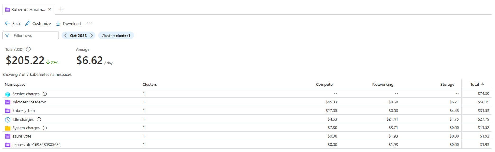
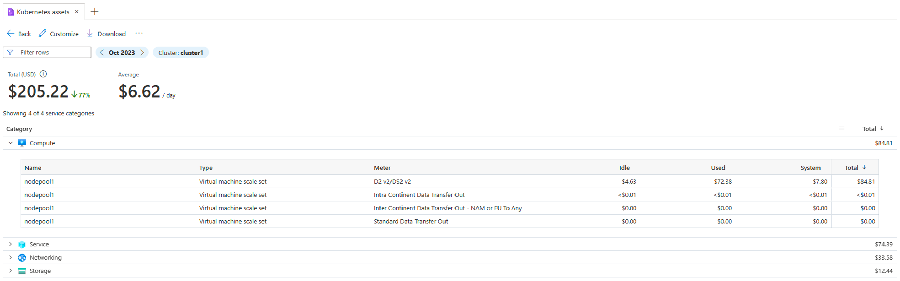

# Cost Governance

Cost Governance is the continuous process of implementing policies to control costs. In the context of Kubernetes, there are a number of ways organizations can control and optimize their costs. These include native Kubernetes tooling to manage and govern resource usage and consumption as well as proactive monitoring and optimize the underlying infrastructure.

Previously, you might have used third-party solutions, like Kubecost or OpenCost, to gather and analyze resource consumption and costs by Kubernetes-specific levels of granularity, such as by namespace or pod. In 2023, AKS has integrated with Microsoft Cost Management (MCM) to offer detailed cost drill down scoped to Kubernetes constructs, such as cluster and namespace, in addition to Azure Compute, Network, and Storage categories.

The AKS cost analysis addon is built on top of OpenCost, an open-source Cloud Native Computing Foundation Sandbox project for usage data collection, which gets reconciled with your Azure invoice data. Post-processed data is visible directly in the MCM Cost Analysis portal experience.

**NOTE**: AKS cost analysis addon is only available for Standard and Premium Tier, not Free Tier.  

## Setup

This should be already done in Day 1, so you might just skip it. 

```bash
az feature register --namespace "Microsoft.ContainerService" --name "ClusterCostAnalysis"
az feature show --namespace "Microsoft.ContainerService" --name "ClusterCostAnalysis"
az provider register --namespace Microsoft.ContainerService
az aks update --name ${PREFIX}-aks --resource-group ${PREFIX}-rg --enable-cost-analysis
```

Check if the add-on pods are running. 

```bash
kubectl get pods -n kube-system -l app=cost-analysis-agent
NAME                                  READY   STATUS    RESTARTS   AGE
cost-analysis-agent-d445b4c48-j6xjv   3/3     Running   0          4m13s
```

## View Kubernetes costs

Microsoft Cost management provides the following views to analyze your Kubernetes costs. 

. Kubernetes clusters – Shows aggregated costs of clusters in a subscription.
. Kubernetes namespaces – Shows aggregated costs of namespaces for all clusters in a subscription.
. Kubernetes assets – Shows costs of assets running within a cluster.

To view AKS costs from the Cost Management page, go to Cost analysis page and select a view under Kubernetes views (preview).


### Kubernetes clusters view

The Kubernetes clusters view shows the costs of all clusters in a subscription. With this view, you can drill down into namespaces or assets for a cluster. Select the ellipsis ( … ) to see the other views.


### Kubernetes namespaces view

The Kubernetes namespaces view shows the costs of namespaces for the cluster along with Idle and System charges. Service charges, which represent the charges for Uptime SLA, are also shown.



### Kubernetes assets view

The Kubernetes assets view shows the costs of assets in a cluster categorized under one of the service categories: Compute, Networking, and Storage. The uptime SLA charges are under the Service category.



Take some time to navigate around the different views and features provided by AKS Cost Analysis add-on.

## Next Steps

[Cluster Monitoring](/cluster-monitoring/README.md)

## Key Links

- [View Kubernetes costs (Preview)](https://learn.microsoft.com/en-us/azure/cost-management-billing/costs/view-kubernetes-costs)
