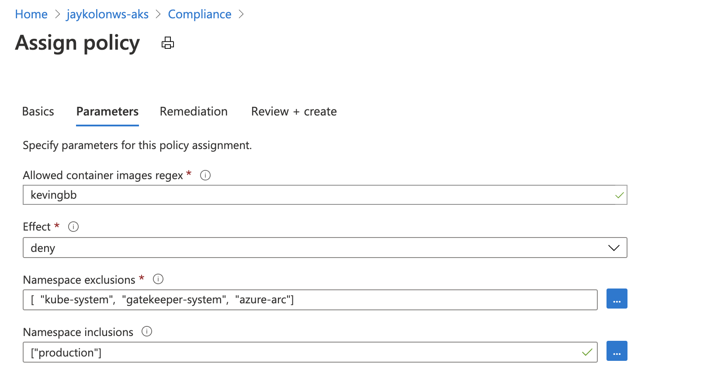

# Post Provisioning

This section walks us through steps that need to get performed after the cluster has been provisioned. These steps can easily be automated as part of a pipeline, but are explicitly pulled out here for visibility.

## Test Post Configuration

This is a quick test to make sure that Pods can be created, and the Ingress Controller default backend is set up correctly.

- First we need to grab AKS cluster credentials, so we can access the api-server endpoint and run some commands.
- Second we will do a quick check via get nodes.
- Lastly, we will spin up a Pod, exec into it, and test our F/W rules.

```bash
# List out AKS Cluster(s) in a Table
az aks list -o table
# Get Cluster Admin Credentials
az aks get-credentials -g $RG -n $PREFIX-aks --admin
# Check Nodes
kubectl get nodes
# Test via a Pod
cat <<EOF | kubectl apply -f -
apiVersion: v1
kind: Pod
metadata:
  name: centos
spec:
  containers:
  - name: centos
    image: centos
    ports:
    - containerPort: 80
    command:
    - sleep
    - "3600"
EOF
# Check if Pod is Running
kubectl get po -o wide
# Once Pod is Running exec into the Pod
kubectl exec -it centos -- /bin/bash
# Inside of the Pod test the Ingress Controller Endpoint
curl 100.64.2.4
# This should be blocked by F/W
curl www.superman.com
# Exit out of Pod
exit
```

## Kubernetes Audit Logs

There is an overwhelming need for organizations to capture all data that they can in case they need it. The Kubernetes audit logs fall into this bucket. It produces a ton of data that chews up storage, and most organizations are not sure what to do with.

So what do we do? We highly encourage organizations to only capture the data that they need to help reduce costs as well as optimize around analytics that need to be done. The less data that needs to be processed, the less compute that is needed, which means less cost. So, do you really need the audit logs?

Ok, you get it, or you don't buy into selectively capturing data. Your organization needs to capture all the data because you don't know what you don't know.

### Capturing & Storing AKS Audit Logs

So how do I capture those Kubernetes audit logs and where should they be put? Directing the logs to Azure Monitor for Containers gets really expensive, really fast, due to the sheer volume of data records that are captured. Considering that most organizations are not 100% sure if they need the logs or not, and to keep costs to a minimum, the guidance is to direct the audit logs to Azure Storage.

- Click [Enable Kubernetes Logs](https://docs.microsoft.com/en-us/azure/aks/view-master-logs) for more details and direct **kube-audit** logs to an Azure Storage Account, **NOT Log Analytics**.

## Setup ACR Permissions

This section sets up the connection between AKS and Azure Container Registry (ACR).

```bash
# Update Azure Container Registries (ACR) in a Table
az aks update -n $NAME-aks -g $RG --attach-acr $ACR_NAME
```

## Find Public IP of AKS api-server Endpoint

This section shows how to find the Public IP (PIP) of the AKS cluster to be able to add it to firewalls for IP whitelisting purposes.

```bash
# Get API-Server IP
kubectl get endpoints --namespace default kubernetes
```

## Find Public IP of Azure Application Gateway used for WAF

This setion shows how to find the Public IP Address of the Azure Application Gateway which is used as a WAF, and the Ingress point for workloads into the Cluster.

```bash
# Retrieve the Public IP Address of the App Gateway.
az network public-ip show -g $RG -n $AGPUBLICIP_NAME --query "ipAddress" -o tsv
```

## OPA and Gatekeeper Policy Setup

In this section we will set up the AKS specific policies we want to enforce. To recap, for our given scenario that means:

- Registry Whitelisting

Azure Policy used OPAv3 to enforce the Pod Security Policy, and it also provides out of the box policies that can secure the AKS cluster. We will use "Ensure only allowed container images in Kubernetes Cluster" to whitelist the registry that contains "kevingbb"




```bash
# Look at Created Resources
# Check Resources
kubectl get crd | grep gatekeeper
kubectl get constrainttemplate,k8sallowedrepos,config -n gatekeeper-system

# Test out Allowed Registry Policy Against production Namespace
kubectl run centosprod --image=centos -it --rm -n production

# Try again with Image from kevingbb
kubectl run bobblehead --image=kevingbb/khbobble -n production

# What did you notice with the last command? The main image got pulled, but the sidecar images did not :).

# Try again in default Namespace
kubectl run centosdefault --image=centos -it --rm -n default

# Test out Connectivity
curl 100.64.2.4
# Exit out of Pod
exit
```

## Next Steps

[Deploy App](/deploy-app/README.md)

## Key Links

- [Enable Kubernetes Logs](https://docs.microsoft.com/en-us/azure/aks/view-master-logs)
- [Patch Management with Kured](https://docs.microsoft.com/en-us/azure/aks/node-updates-kured)
- [Azure Traffic Analytics](https://docs.microsoft.com/en-us/azure/network-watcher/traffic-analytics)

